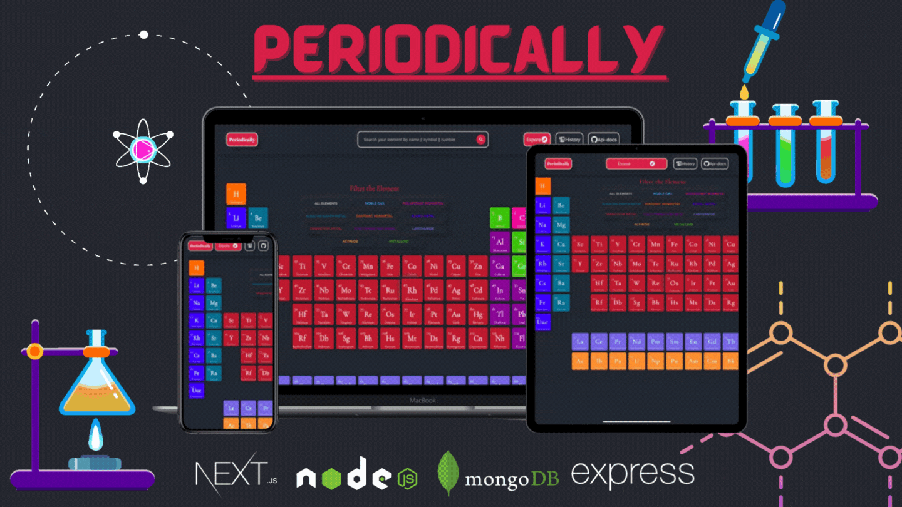
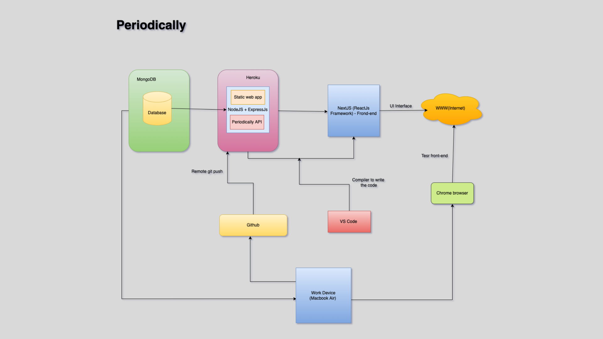

### Periodically - The Periodic table [visit site](https://periodically-webapp.vercel.app/)
<p align="center">

</p>




## ⚛️ Why a periodic table
In **Periodically** web application you will find a huge amount of data about chemical elements for free. You will learn a lot of new and useful for yourself, no matter you are a schoolboy, student, engineer, housewife or a person of any other provisions that does not have a refresher to Chemistry.

The chemistry falls into to number of the most important sciences and is one of the main school obiects.
Its studying begins with the Periodic Table. Interactive approach to a training material is more effective than classical. As in it
technologies which became the family for the modern pupils are used.

## Periodically Demo


## 📌 Discription 

**Periodically** - is a free web application which displays the entire Periodic Table at startup interface. The table has a long-
form approved by the International Union of Pure and Applied Chemistry (IUPAC) as the core. Besides the Periodic Table of
chemical elements, you can use the Table of solubility.

The chemistry falls into to number of the most important sciences and is one of the main school obiects.
Its studying begins with the Periodic Table. Interactive approach to a training material is more effective than classical. As in it
technologies which became the family for the modern pupils are used.


## ✨ Features
- Displays the entire Periodic Table at startup interface.
- Thought of the day.
- When you click on any element provides information that is constantly updated.
- For most of the items have an image.
- For more information, there are direct links to Wikipedia for each item
- Table solubility
- To find any element you can use the search. The search engine is not choosy to the registry or writing style search.
- You can sort the items in 10 categories:
• Alkaline earth metals
• Other nonmetals
Alkali metals
• Halogens
• Transition metals
• Noble gases
• Semiconductor
• Lanthanides
• Metalloids
• Actinides
Elements of the selected category will be listed in the search results and are highlighted in the table on the main application
screen.


## 😎 The Stack used : MERN:


 1. **Node.js** : 
As an asynchronous event-driven JavaScript runtime, Node.js is an extremely powerful JavaScript-based platform used to develop online chat applications, video streaming sites, single-page applications, and many other I/O-intensive web applications and web apps. 

 2. **Express.js** : 
Express is a node js web application framework that provides broad features for building web and mobile applications. It is used to build a single page, multipage, and hybrid web application.
It's a layer built on the top of the Node js that helps manage servers and routes. 

3. **MongoDb** : 
MongoDB is a non-relational document database that provides support for JSON-like storage. The MongoDB database has a flexible data model that enables you to store unstructured data, and it provides full indexing support, and replication with rich and intuitive APIs. 

4. **Next.js/React.js** : 
Next. js is a React framework that gives you building blocks to create web applications. By framework, we mean Next. js handles the tooling and configuration needed for React, and provides additional structure, features, and optimizations for your application.

5. **Additional tech** :  
 Periodically is a fully responsive web appication build using MERN Stack (Next js) which use **Context api** for state manangement, **Tailwind css** for styling and **Material Icon** for icons.
 
## 🛠️  Design Architecture



## 🛠️  Periodically_servers (API)

A simple NodeJS API for **Periodic Table Elements** returns in JSON format.
You can access the data by using this link:
[Periodically](https://periodically-servers.herokuapp.com/)


## Expected JSON Data Format


```json
    {
    "name": "Hydrogen",
    "appearance": "colorless gas",
    "atomic_mass": 1.008,
    "boil": 20.271,
    "category": "diatomic nonmetal",
    "color": null,
    "density": 0.08988,
    "discovered_by": "Henry Cavendish",
    "melt": 13.99,
    "molar_heat": 28.836,
    "named_by": "Antoine Lavoisier",
    "number": 1,
    "period": 1,
    "phase": "Gas",
    "source": "https://en.wikipedia.org/wiki/Hydrogen",
    "spectral_img": "https://upload.wikimedia.org/wikipedia/commons/e/e4/Hydrogen_Spectra.jpg",
    "summary": "Hydrogen is a chemical element with chemical symbol H and atomic number 1. With an atomic weight of 1.00794 u, hydrogen is the lightest element on the periodic table. Its monatomic form (H) is the most abundant chemical substance in the Universe, constituting roughly 75% of all baryonic mass.",
    "symbol": "H",
    ":": 1,
    "ypos": 1,
    "shells": [
        1
    ],
    "electron_configuration": "1s1",
    "electron_configuration_semantic": "1s1",
    "electron_affinity": 72.769,
    "electronegativity_pauling": 2.2,
    "ionization_energies": [
        1312
    ],
    "cpk-hex": "ffffff"
    }
```
---

## 💻 Development
### Install Repository
```git
git clone https://github.com/HarshKumarraghav/periodically_webapp
```

### Run Project
Install node modules and run project.
```
npm install 
or
yarn install
```
```
npm run dev
or 
yarn run dev
```
### Finish
```
Your project is running on https://localhost:3000.
```

## 💡 Upcoming Feature

- Authentication
- Periodical Table - History 
- Subcription based data 
- payment system (stripe or paytm)
- Newsletter
- Contact us page
